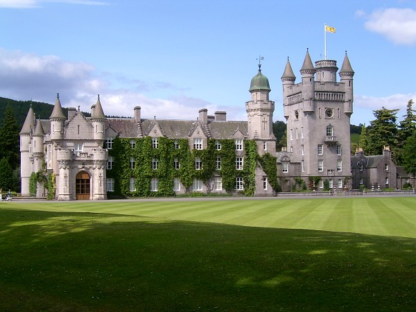

# Balmoral Castle 3D postcard
Unity 3D project that uses augmented reality to display 3D model of  [Balmoral Castle](https://en.wikipedia.org/wiki/Balmoral_Castle) on a postcard image. 3D model was created in Blender, while mobile app was created in Unity.

## Demo :movie_camera:
Check out demo video [here](https://drive.google.com/file/d/1Czkvjn7wkE31fF2adFrvMsKmjsS4Jthn/view).

## How to use
Note that application is currently only supported on Android devices.

 1. Download .apk file from [here](https://drive.google.com/drive/folders/1qKFPsOT-8eqSSGNaFzEL_V-l3CNZEHeK)
 2. Check whether [installing unknown apps](https://www.lifewire.com/install-apk-on-android-4177185) is allowed.
 3. Tap .apk file to install it.
 4. Open installed Balmoral application 
 5. Point camera towards following image:
 
 6. Explore and enjoy magic of AR :)

